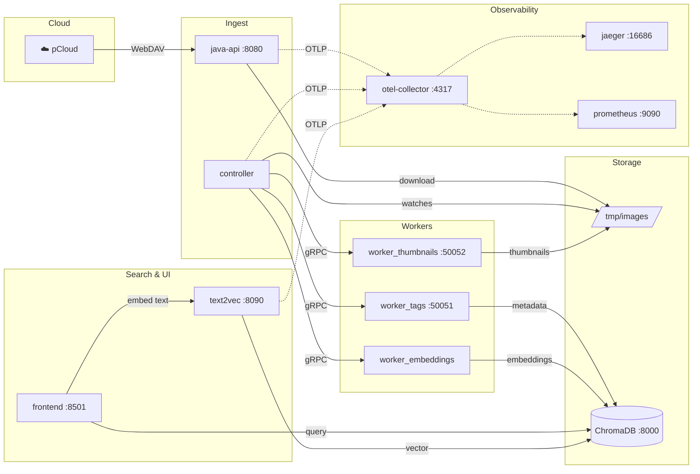

<p align="center">
  
</p>

<h1 align="center">pixplore</h1>

<p align="center">
  <strong>AI-powered Image Explorer</strong><br>
  <em>Search your photo library with natural language. Powered by BLIP2 embeddings, gRPC microservices, and a Saga orchestrator.</em>
</p>

<p align="center">
  
  
  
  
  
</p>

---

## What it does

| Feature | Description |
|---------|-------------|
| ☁️ **Cloud Sync** | Pulls images from pCloud via WebDAV (Spring Boot) |
| 🏷️ **Auto-Tagging** | Extracts EXIF metadata, GPS, dates, faces |
| 🖼️ **Thumbnails** | Generates optimized previews on ingest |
| 🧠 **Embeddings** | BLIP2 image+text embeddings stored in ChromaDB |
| 🔍 **Semantic Search** | "sunset at the beach" → finds matching photos |
| 👤 **Face Recognition** | Finetuned model detects family members |
| 📊 **Observability** | Distributed tracing (Jaeger) + metrics (Prometheus) via OTel |

**Target Platform:** Docker Compose → Pulumi (lokal) → GKE (Google Cloud)

## Architecture



### Data Flow

```
pCloud → java-api → /tmp/images/*.jpg → Controller ─┬→ Worker_Tags → ChromaDB (metadata)
                                                     ├→ Worker_Thumbnails → /thumbnails/
                                                     └→ Worker_Embeddings → ChromaDB (vectors)

Frontend → text2vec (BLIP2) → Embedding → ChromaDB Cosine Similarity → Results
```

## Services

| Service | Port | Description |
|---------|------|-------------|
| `java-api` | 8080 | Spring Boot — syncs images from pCloud via WebDAV |
| `frontend` | 8501 | Streamlit UI — browse, filter, semantic search |
| `text2vec` | 8090 | FastAPI — BLIP2 text embeddings |
| `chromadb` | 8000 | Vector database (metadata + embeddings) |
| `worker_tags` | 50051 | gRPC — EXIF extraction → ChromaDB |
| `worker_thumbnails` | 50052 | gRPC — thumbnail generation |
| `worker_embeddings` | — | gRPC — BLIP2 image embeddings → ChromaDB |
| `controller` | — | Saga orchestrator — dispatches to workers |
| `otel-collector` | 4317/4318 | OpenTelemetry Collector (OTLP) |
| `jaeger` | 16686 | Distributed tracing UI |
| `prometheus` | 9090 | Metrics scraping & queries |

## Quickstart

### Option A: Docker Compose

```bash
# 1. Configure credentials
cat > .env <<EOF
PCLOUD_USERNAME=your@email.com
PCLOUD_PASSWORD=your-password
EOF

# 2. Launch
docker compose up --build
```

### Option B: Pulumi (recommended)

```bash
cd pulumi/local
python -m venv venv && source venv/bin/activate
pip install -r requirements.txt
pulumi login --local
pulumi stack init dev
pulumi up
```

### Access

| | URL |
|-|-----|
| 🖼️ Frontend | http://localhost:8501 |
| 📡 API (Swagger) | http://localhost:8080/swagger-ui.html |
| 🔍 Jaeger Traces | http://localhost:16686 |
| 📊 Prometheus | http://localhost:9090 |

## Minikube Deployment

K8s-Manifeste liegen in `k8s/`. Nutzt `hostPath` für lokalen Dateizugriff.

### Voraussetzungen

- Minikube installiert und gestartet (`minikube start`)
- `kubectl` installiert

### 1. Images in Minikube bauen

```bash
eval $(minikube docker-env)
docker build -t java-api ./src/sync_images/pcloud-java
docker build -t frontend ./src/frontend
```

### 2. Secret anlegen

`k8s/secret.yaml` ist in `.gitignore` — manuell erstellen:

```yaml
apiVersion: v1
kind: Secret
metadata:
  name: pcloud-credentials
  namespace: pixplore
type: Opaque
stringData:
  PCLOUD_USERNAME: "deine@email.com"
  PCLOUD_PASSWORD: "deinPasswort"
```

### 3. Host-Verzeichnis mounten

```bash
minikube mount /tmp/images:/tmp/images &
```

### 4. Deployen

```bash
kubectl apply -f k8s/
```

### 5. Port-Forwarding (von anderen Rechnern erreichbar)

```bash
kubectl port-forward svc/java-api 8080:8080 -n pixplore --address 0.0.0.0 &
kubectl port-forward svc/frontend 8501:8501 -n pixplore --address 0.0.0.0 &
```

### Nützliche Befehle

```bash
kubectl get pods -n pixplore                      # Pod-Status
kubectl logs -f deployment/java-api -n pixplore   # Logs
kubectl exec -it deployment/java-api -n pixplore -- sh  # Shell im Container
kubectl rollout restart deployment/java-api -n pixplore # Pod neustarten
minikube service java-api -n pixplore --url       # Service-URL anzeigen
kubectl delete -f k8s/                            # Alles aufräumen
```

## Internet Facing

Using [Cloudflare Tunnel](https://developers.cloudflare.com/cloudflare-one/connections/connect-networks/) + [Cloudflare Access](https://developers.cloudflare.com/cloudflare-one/policies/access/) for secure public access with authentication.

### Expose via Cloudflare Tunnel

```bash
cloudflared tunnel run pixplore
```

### Authentication

Cloudflare Access with email-based OTP. Only whitelisted emails can access the app.

### Setup Steps

1. Buy domain at Cloudflare Registrar
2. Install `cloudflared` on server
3. Create tunnel: `cloudflared tunnel create pixplore`
4. Configure tunnel to proxy to `http://localhost:8501`
5. Add DNS route: `cloudflared tunnel route dns pixplore <subdomain>`
6. Create Access policy: allow only whitelisted emails

## Tags

Table schema für Tags
-------------------------------
GPS Location: TEXT
City: TEXT
Country: TEXT
Year: INTEGER
Month: INTEGER
Day: INTEGER
Peron_janine: BOOLEAN
Person_micmink: BOOLEAN
Person_other: BOOLEAN
Count_faces: INTEGER
ref_image_path: TEXT
ref_thumbnail_path: TEXT
